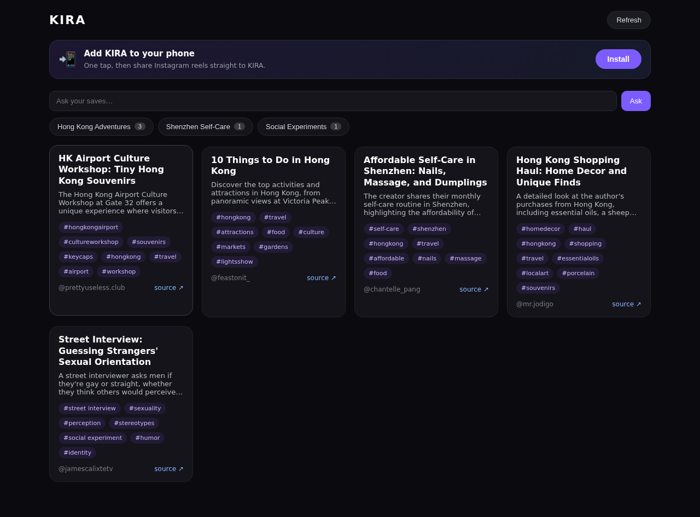
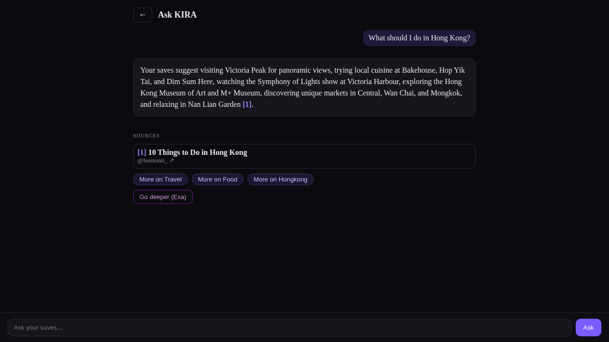
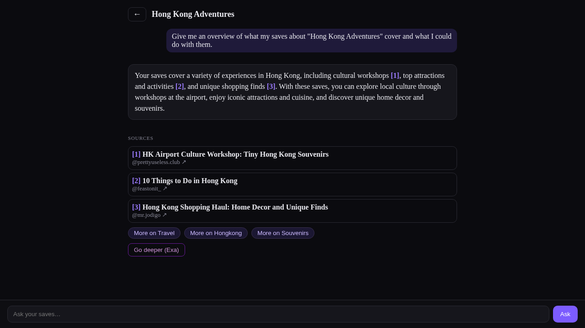
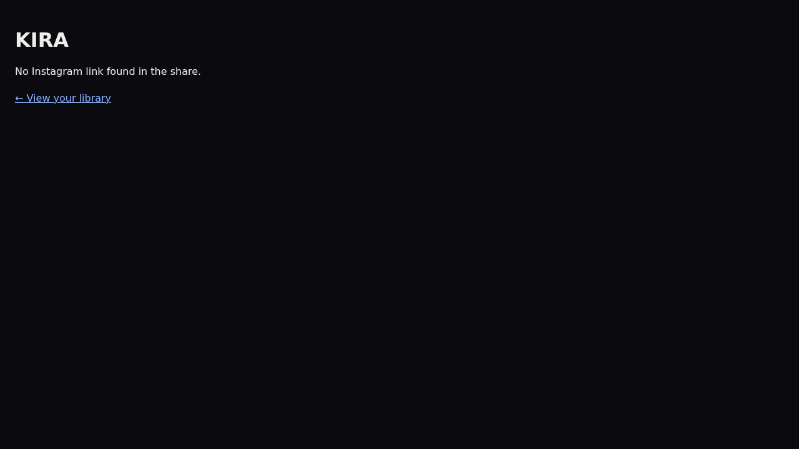

# KIRA — UI Screens & Design Handoff

**For:** Angelina (product/design) · **From:** the build side
**Purpose:** the complete list of screens, states, and components in the KIRA PWA as it stands today, so you can design/redesign the UI. Each live screen has a screenshot of its *current* (functional, lightly-styled) state — these are the starting point, not the target.

**Live app:** https://kira-pwa-rho.vercel.app
**Demo flow (highest design priority):** Home → tap a theme bubble (or Ask bar) → Chat answers from your saves with citations → "Go deeper". Design these first.

## Current brand baseline (in code today — change freely)
- Background `#0b0b0f`, cards `#16161c`, borders `#2a2a33`
- Accent purple `#7c5cff`, citation links `#9b7cff`, muted text `#8a8a99`, error `#ff6b6b`
- Mobile-first (it's an installed Android PWA); the Ask bar is fixed to the bottom on the Chat screen.

---

## A. Live pages

### 1. Library / Home  ⭐ demo-critical
Route `/`. Header (KIRA + Refresh), install banner, **Ask bar**, **theme-bubble row**, saved-item **card grid**.

### 2. Chat — free-text answer  ⭐ demo-critical (the hero screen)
Route `/chat?q=…` (from the Ask bar). Question bubble → answer with inline `[n]` citation links → **Sources** cards → follow-up chips → **Go deeper (Exa)** → bottom Ask bar.

### 3. Chat — theme-scoped overview  ⭐ demo-critical
Route `/chat?theme=…` (from tapping a bubble). Same layout as #2, but the header is the **theme name** and the answer is grounded in *only that theme's* saves.

### 4. Share handler  ⚠️ biggest design gap (currently unstyled)
Route `/share`. What the user sees right after **Share → KIRA** from Instagram. Today it's bare system-default text ("Saving to KIRA…" / "Saved! KIRA is processing it." / error). Needs the full brand treatment + a nice confirmation/processing state.

---

## B. Chat screen — states (one route, several distinct designs)
The `/chat` screen changes by state — each deserves a mock:
1. **Idle** — a "RECENT" list of the last-10 questions (and an empty state: "Ask KIRA anything about your saves").
2. **Loading** — "KIRA is reading your saves…".
3. **Answered** — the hero layout in screenshots #2/#3.
4. **Error** — "KIRA couldn't answer that — try again" + a **Retry** button.
5. **Scoped variant** — header shows the theme name (screenshot #3).

## C. Library — states (same route)
- **Loading** ("Loading your library…"), **Empty** ("Your library is empty — share an Instagram reel"), **Error** ("Couldn't reach KIRA").

---

## D. Reusable components (each needs a design spec)
- **Theme bubble** — pill + count badge.
- **Library card** — thumbnail, title, summary, `#tags`, `@author`, source link.
- **Source card** — the cited-save card shown under a Chat answer.
- **Follow-up chip** — tappable suggestion under an answer.
- **Ask bar** — text input + Ask button (bottom-fixed on Chat).
- **Go deeper (Exa) button**.
- **Install prompt** — has **3 variants**: default (+ Install button) / just-installed / already-installed.

## E. Brand / PWA assets
- **App icon / logo** — appears in the **Android share sheet** ("Share → KIRA") and on the home screen. High visibility; key brand moment.
- App name, splash screen, theme color (currently dark `#0b0b0f`), web manifest.

---

## F. Roadmap screens — design *ahead* (not built yet)
- **Exa "go deeper" results** — the web-results panel under a Chat answer (next build).
- **Stripe paywall** — Free vs **KIRA Pro** upgrade screen + the upgrade flow (demo switches between 2 seeded accounts).
- **Image-post / carousel card** — vision-only saves (no transcript); may need a different card look than reels.
- **Wow Layers 2 & 3** — cross-theme insights (e.g. "acid reflux after coffee"). **Still undefined** — concept needs to be set with the team before designing.
- *(Maybe)* **Inbox** — for unclear/auto-tagged saves (in the original product brief; not built).

---

## Notes
- Everything in sections A–C is **functional and live** — these screenshots are the current state to redesign, not mockups.
- The build side will integrate your designs; the structure above maps 1:1 to the code (`app/page.tsx`, `app/chat/page.tsx`, `app/share/page.tsx`, and the `components/` + `ThemeBubbles`/`InstallPrompt`).
- Screenshots regenerated 2026-06-09 from the live deploy.
